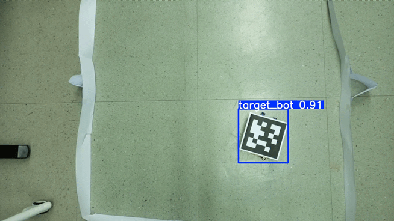
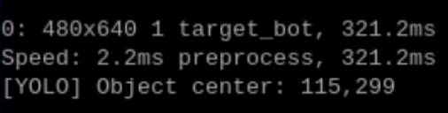

# AI_Yolo

라즈베리파이에서 동작하는 추론 서비스가 사용하게 될 **AI 모델/학습 자산**을 관리하는 레포지토리입니다.  
객체 인식 작동과 운영 코드는 별도 [**라즈베리파이 레포지토리**](https://github.com/2025-Capstone-designe/RP5.git)에 있습니다.

## 기능
1. YOLOv8n 기반 객체 탐지 모델(파인튜닝된 `best.pt`) 보관
2. 학습/파인튜닝 스크립트(`yolo_train.py`) 및 데이터셋 설정(`data.yaml`) 제공
3. 로컬 디버깅/시연용 간단 추론 서버 예시(`yolo_fine.py`) 포함
4. 라즈베리파이 레포지토리의 실제 서비스 코드가 이 모델을 불러 영상 캡처 중 탐지를 수행

## 사용법

#### **라즈베리파이**
- 라즈베리파이 레포지토에서 `Yolov8n/best.pt` 경로만 참조해 실시간 추론에 사용하면 됩니다.

#### **로컬 테스트(PC)**

- `ultralytics` 설치 후 이미지나 웹캠을 사용해 동작 확인 가능합니다.

```python
# 웹캠 테스트
from ultralytics import YOLO
YOLO("Yolov8n/best.pt").predict(source=0, conf=0.30, iou=0.45, show=True)
``` 

## 동작 예시

#### YOLO 검출 결과

  

#### 콘솔 추론 로그

  

> 프레임의 해상도, 박스 수, 레이턴시, 객체의 중심 등은 라즈베리 레포의 출력 포맷 기준으로 표시됩니다.

## 연동 인터페이스

| 항목        | 내용               |
| --------- | ---------------------------------- |
| 서버 프레임워크  | Flask                              |
| 실행 바인딩    | host=`0.0.0.0`, port=`5005`        |
| 모델 로드 경로  | `best.pt` (상대경로)                   |
| 입력 소스(예시) | 외부 카메라                       |


## 디렉터리 구조

```
Yolov8n/
├── best.pt
├── data.yaml
├── yolo\_fine.py         # 로컬 디버깅용 예시
└── yolo\_train.py        # Colab 학습 예시
media/                    # 본 README에 포함된 예시 이미지/영상
├── yolo출력.png
├── yolo\_gif.gif
├── 시스템 시나리오.png
├── 시스템 아키텍처.png
└── 프론트 화면.jpg
```
